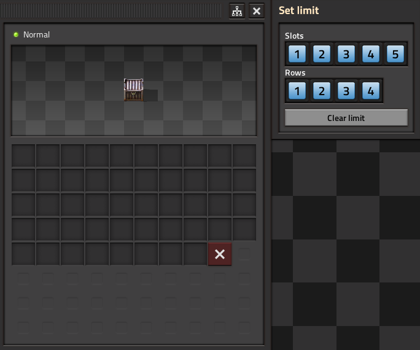

# Quick Chest Limit
Set chest limits with one clicks for common limit amounts. For common limits, this is quicker and less error-prone than setting the limit by clicking the red button, and then moving the cursor to the desired limit location and clicking again.

## Motivation
1. This is mostly because https://forums.factorio.com/viewtopic.php?f=23&t=109212&p=594162 was classified as not a bug. I still find that UI cumbersome when needing to configure a bunch of chest limits when working with passive provider chests that would be way too large of a buffer if allowed to fill completely. So this mod exists so I don't have to use the vanilla chest limit UI and hopefully you don't have to either.

## Features
1. Tiny GUI to the side of the chest that has buttons for setting chest limits with one click.

## Credits
1. [test447](https://mods.factorio.com/user/test447) - code